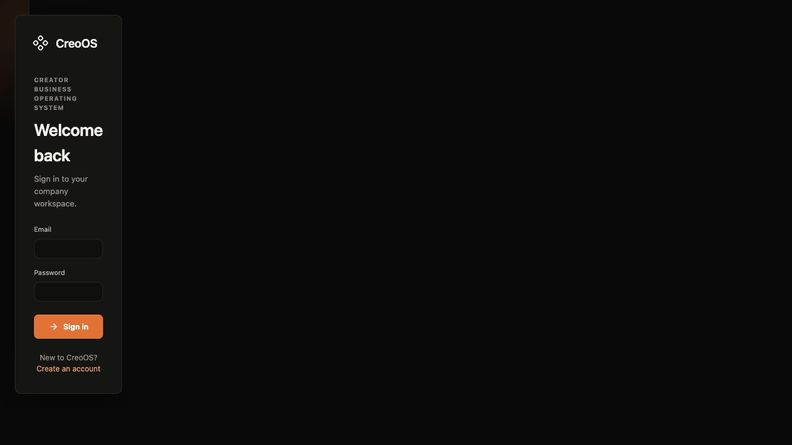
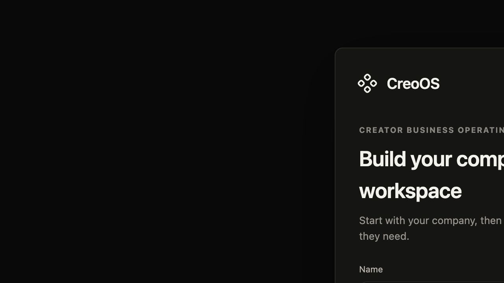

# CreoOS

CreoOS is a focused operating system for creator businesses. It brings content, tasks, courses, sponsors, affiliates, analytics, and team operations into one workspace with role-aware access and InsForge-backed authentication.





## What is included

- Creator workspace dashboard with modular navigation
- Email/password authentication, password reset, and onboarding
- Role-aware team access and protected workspace routes
- Content, tasks, courses, sponsors, affiliates, analytics, and settings modules
- InsForge SDK integration for auth, database access, and server-side sessions
- Security headers and a production Next.js build ready for Vercel

## Local development

Requirements: Node.js 20+ and npm.

```bash
npm install
cp .env.example .env.local
```

Fill in the two public InsForge values in `.env.local`, then start the app:

```bash
npm run dev
```

Open [http://localhost:3000](http://localhost:3000).

## Environment variables

`.env*` files are ignored by Git. Keep the InsForge admin API key server-only and out of GitHub, Vercel client variables, screenshots, logs, and documentation. The anon key is designed for user-scoped client access; configure it in Vercel as an environment variable rather than committing it.

See [.env.example](.env.example) for the required variable names.

## Verification

```bash
npm run lint
npm run build
```

The Vercel project should use the default Next.js framework settings and these environment variables for Preview and Production:

- `NEXT_PUBLIC_INSFORGE_URL`
- `NEXT_PUBLIC_INSFORGE_ANON_KEY`

## Deployment

This repository is intended to deploy from its private GitHub `main` branch through Vercel. Import the repository into Vercel, add the environment variables above in Project Settings, and deploy. Vercel automatically detects the Next.js build.

## Tech stack

Next.js 16 · React 19 · TypeScript · Tailwind CSS · InsForge · Radix UI
